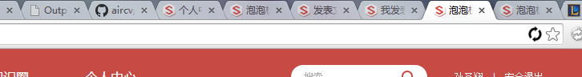
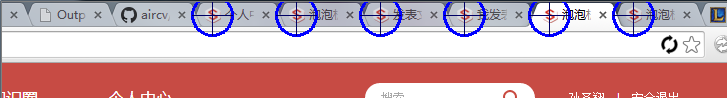

# aircv4nodejs

依靠的opencv，查找相似图像的位置信息。

Find object position based on opencv4nodejs for nodejs

## Usage

    import * as ac from 'aircv4nodejs';
    const sourceImg=ac.imread('youimage.png'); // 原始图像
    const searchImg=ac.imread('searched.png'); // 待查找的部分
    
#### SIFT查找图像
    const resultList=ac.findSift(sourceImg,searchImg);
    {'point': (203, 245), 'rectangle': [(160, 24), (161, 66), (270, 66), (269, 24)], 'confidence': 0.09}
    // result :查找到的点的坐标
    // rectangle: 目标图像的矩形四个点的坐标
    // confidence 相似度（匹配成功的特征点除以总的特征点）

#### SIFT多个相同的部分查找
    const resultList=ac.findAllSift(sourceImg,searchImg,4,0);
    
maxcnt 是可选参数，限制最多匹配到的数量

#### 直接匹配查找图像

    const resultList=ac.findTemplate(sourceImg,searchImg);
查找多个相同的图片，如在图形

中查找

    const resultList=ac.findAllTemplate(sourceImg,searchImg);
    
效果

